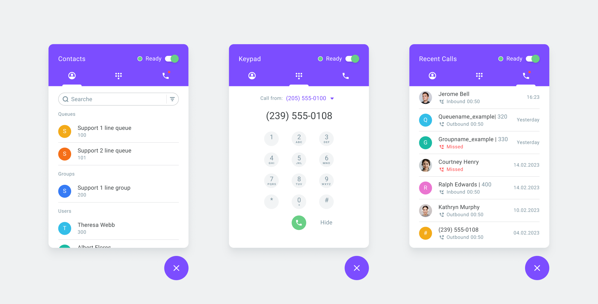

# Voximplant. Kit Desktop Softphone 

Voximplant Kit Desktop Softphone is a telephony application you install on your PC (Windows, Mac, Linux) to make and receive calls via Voximplant Kit.

You can use the softphone independently to handle calls from anywhere on your desktop. It gives you the power and the context needed for real-time interaction with your customers. [Learn more]( https://voximplant.com/kit/docs/contactcenter/desktopsoftphone)

